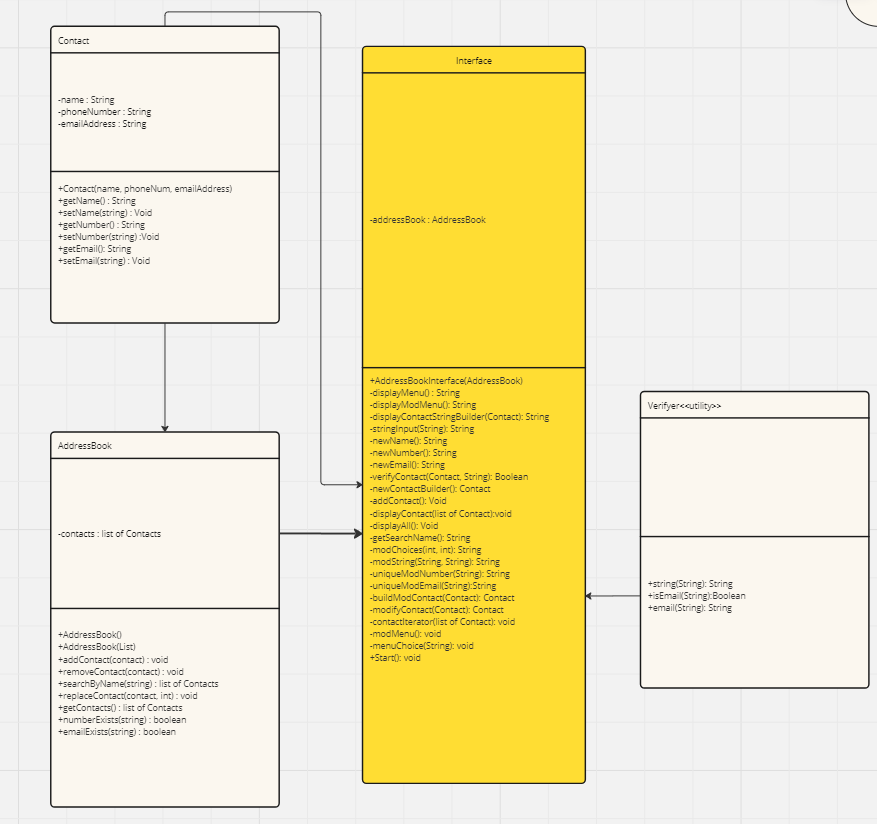

# Domain Models, Class Diagrams and Test Plan

## UML Class Diagram

## User story 1
as a user I want to be able to add a contact, which consists of at least a name, a phone number and an email address to my address book, so I can look them up later

## Test plan 1
### Contact class
- [x] you can instantiate an object of class Contact and return the name, telephone number and email address
- [x] you can change the telephone number
- [x] you can change the email address
- [x] you can change the name of the contact

### Interface class
- [ ] correctly handles null strings
- [ ] correctly hands empty strings
- [ ] only allows the user to continue if a valid input has been entered
- [ ] correctly handles invalid email address
- [ ] correctly creates a contact and adds to the address book

## User story 2

As a user, I want to see all of the contacts in the address book, so I can review the details in my address book easily

### AddressBook Class

- [x] you instantiate an AddressBook and it returns and empty array list
- [ ] you can add a contact to the AddressBook and it returns a list with one item in it
- [ ] if multiple contacts have been added to the addressbook, it returns all of them as a list

### Interface Class
- [ ] The interface will display all of the contacts in the addressbook to the screen

## User story 3

As a user I want to be able to search for a contact by name and have the results displayed, so I can find out the details I stored

### AddressBook Class

- [ ] entering a name will find all contacts which start with that name

### Interface Class

- [ ] will display all contacts AddressBook returns
 
## User Story 4

As a user I want to be able to remove a contact from the address book, for when I no longer need to keep their details

### AddressBook Class

- [ ] removes the supplied contact from the arraylist

### Interface Class

- [ ] selecting remove contact will delete the contact from the addressbook

## User Story 5

As a user I want to be able to edit a contact, so that I can keep the details correct without having to completely re-enter a contact

### Addressbook Class

- [ ] passing in a Contact and a location will replace the contact in that location with the class

### Interface Class

- [ ] choosing to edit a contact will give you the opportunity to change it's details

## User Story 6

As a user, I don't want there to be two people with the same phone number, so that...actually I can't think of a good reason for this...

### Interface Class

- [ ] creating a new contact won't accept telephone numbers already in the addressbook
- [ ] editing a contact won't accept telephone numbers already in the addressbook
- [ ] editing a contact will accept the same number being re-entered

## User Story 7

As a user, I don't want there to be duplicate email addresses, so that...I can't think of a good reason for this either

### Interface Class

- [ ] creating a new contact won't accept email addresses already in the addressbook
- [ ] editing a contact won't accept email addresses already in the addressbook
- [ ] editing a contact will accept the same email addresses being re-entered

## User Story 8

As a user, I want the interface to be a console one.

### Interface class

-[ ] interface is entirely console driven.